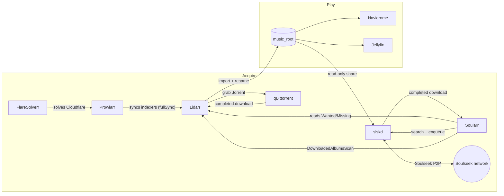

# Music pipeline

How music gets from "I want this album" to "it plays on my phone" on Theseus.



## Roles of each service

| Service | Role | Talks to |
| --- | --- | --- |
| **Lidarr** | Source of truth for *what* should be in the library: monitored artists, the Wanted/Missing list (~4k albums), quality profiles (`Lossless`, `Standard`, `Any`), renaming and import. | Prowlarr (indexers), qBittorrent (download client), Soularr (via its API). |
| **Prowlarr** | Indexer manager. Holds the torrent trackers (RuTracker, Toloka, PandaCD, …) and pushes them into Lidarr (`fullSync`), so indexers are configured only once. | Lidarr, FlareSolverr. |
| **FlareSolverr** | Headless browser proxy Prowlarr uses for trackers behind Cloudflare challenges. | Prowlarr. |
| **qBittorrent** | Torrent download client. Lidarr sends grabs to it and watches for completion. | Lidarr. |
| **slskd** | Soulseek client with a web UI and REST API. Shares the music library (read-only) and downloads into `media/soulseek/downloads`. | Soulseek network, Soularr. |
| **Soularr** | Glue script (runs every `slskd_soularr_interval` seconds, started only once slskd is healthy). Soulseek is not a Lidarr indexer or download client in stable Lidarr, so Soularr plays both roles from outside. | Lidarr API, slskd API. |
| **Navidrome** | Subsonic-compatible streaming server over `music_root` (read-only). Used by phone/desktop clients. | — |
| **Jellyfin** | Also indexes `music_root` for its own clients. | — |

## Lidarr → Soularr → slskd in detail

Soularr is a sidecar in the `slskd` role (`roles/applications/slskd`). Each run:

1. **Read Wanted.** It calls Lidarr `wanted/missing` (`search_source = missing`). With
   `search_type = incrementing_page` it takes the next page of
   `slskd_soularr_albums_per_run` albums and stores the page cursor in
   `soularr/.current_page.txt`. The backlog is walked a few albums per run
   instead of all 4k at once.
2. **Search.** For each album it asks slskd to search `"<artist> <album>"`, waits
   `search_timeout`, and scores the results. The folder must contain the right
   track count for one of the album's releases (`accepted_formats`,
   `accepted_countries`), filenames must match track titles
   (`minimum_filename_match_ratio`), and files must be one of
   `slskd_soularr_allowed_filetypes` (tried in order: FLAC hi-res → FLAC → MP3 320).
   Peers with long queues are skipped (`maximum_peer_queue`).
3. **Enqueue.** It enqueues the best folder in slskd. slskd downloads into
   `/incomplete`, then moves the files to `/downloads/<folder>`.
4. **Wait and import.** On later runs it checks the transfers. When a folder is complete, it
   moves the folder to `Artist - Album` and calls Lidarr's
   `DownloadedAlbumsScan` command with the path as **Lidarr** sees it
   (`slskd_lidarr_downloads_directory`). From then on this is a normal Lidarr import:
   matching, quality-profile checks, renaming into `music_root`.
5. **Failures.** No results means the album stays Wanted and gets another chance on a later pass
   (`remove_wanted_on_failure` is off). Stalled transfers are cancelled
   after `stalled_timeout`. A folder that Lidarr refuses to import is
   denylisted (`failed_import_denylist`) so the same bad folder isn't retried.
   None of this touches the torrent path. Lidarr keeps searching indexers on its own schedule,
   and whichever source lands first wins.

### Path mapping (why downloads live under `media/`)

Lidarr has a single mount: `qbittorrent_download_directory` (`/mnt/data/data`) → `/downloads`.
A second mount would get a different device id and break hardlinks and moves. slskd's download dir
therefore sits inside that tree:

| Host | slskd | Soularr | Lidarr |
| --- | --- | --- | --- |
| `/mnt/data/data/media/soulseek/downloads` | `/downloads` | `/downloads` | `/downloads/media/soulseek/downloads` |
| `/mnt/data/data/media/soulseek/incomplete` | `/incomplete` | — | — |
| `/mnt/data/data/media/music` (`music_root`) | `/music` (ro, shared) | — | `/downloads/media/music` (root folder) |

`slskd_lidarr_downloads_directory` derives the Lidarr-side path automatically.

### Quality

Soularr only filters by file type. The import decision stays with Lidarr: an MP3
downloaded for an artist on the `Lossless` profile is rejected at import and
denylisted. To avoid wasted downloads, keep `slskd_soularr_allowed_filetypes`
in line with the profiles in use.

## Configuration

- Role vars: `roles/applications/slskd/defaults/main.yml`.
- Enable: `slskd_enabled`, `slskd_soularr_enabled` in `inventories/local/group_vars/nas/main.yml`.
  Turning Soularr off leaves slskd running for manual use (`remove_orphans` drops the container).
- Secrets (`secrets.yaml`): `slskd_soulseek_username`, `slskd_soulseek_password` (the account
  is registered on first login), `slskd_web_password`, `slskd_api_key`. Soularr also uses the existing
  `lidarr_api_key`.
- Throughput: `slskd_soularr_albums_per_run` × runs per day
  (`86400 / slskd_soularr_interval`). The defaults (5 every 5 min, at most about 1,400 per day) are sized for
  the first rollout. Raise them once imports are confirmed working.
- Network: peer port `50300/tcp` is forwarded on the router to Theseus. Without it, downloads
  from firewalled peers (a large share of the network) fail with connection timeouts.
- Expect waits: a download sits in the other user's upload queue (`Queued, Remotely`) until
  they get to it. Soularr waits for its current batch before searching again, and cancels anything
  stuck in a remote queue longer than `remote_queue_timeout` (5 min) or stalled longer than
  `stalled_timeout` (1 h).
- UI: `http://slskd.theseus` (LAN only, `web_local`).

## Rollout checklist

1. `task theseus -- slskd`
2. slskd UI: logged in to Soulseek, share scan finished.
3. `docker logs -f soularr`: first run searches 5 albums and enqueues matches.
4. Lidarr → Activity/History shows the imports. Files appear under `music_root`, and Navidrome picks them up on its next scan.
5. Tune `slskd_soularr_albums_per_run` / `slskd_soularr_interval`.

## Clearing "Import Failed"

Lidarr can't import two kinds of torrent releases and leaves them stuck in the queue:

- **Images**: a CUE image (one big `.flac`/`.ape` + `.cue`), or any release with a single `.flac`. Lidarr never splits them.
- **Mixed FLAC + MP3** releases: Lidarr maps one format and fails the album instead of preferring the better one.

The lidarr role installs `lidarr-fix-imports.py` into `lidarr_directory`. Run it on Theseus:

```sh
python3 /mnt/nvme/appdata_large/lidarr/lidarr-fix-imports.py            # dry run, report only
python3 /mnt/nvme/appdata_large/lidarr/lidarr-fix-imports.py --apply    # act
#   --only complete|removed|stalled|image|archive|mixed|other|orphans   --limit N   --min-match 70   --stalled-days 7
```

- `complete`: stuck or still-downloading items whose album already has all tracks at or above the profile cutoff (filled by another release or a rescan) are removed from the queue and qBittorrent, with no blocklist and no new search. Lidarr never does this by itself.
- `removed`: queue items left behind by artists you removed from Lidarr (they show as "Artist name mismatch", with no artist and no grab history) are removed from the queue and qBittorrent with their files, unless their audio is in the library. No blocklist, no search.
- `stalled`: downloads added more than `--stalled-days` ago (default 7) where qBittorrent hasn't seen a peer with the complete files in that time (upload activity between partial holders doesn't count) are removed, blocklisted, and searched again.
- Images are removed from the queue and qBittorrent, the release is blocklisted, and Lidarr searches again.
- For mixed releases, only the FLAC files are hardlinked
  into a scratch folder and imported only if Lidarr matches every track cleanly. The torrent's files are left alone, so it keeps seeding.
- Archives (only `.zip`/`.rar`/`.7z`/`.iso`, or only video like `.avi`/`.mkv`/`.mp4`/`.mpg`) are treated like images.
- Everything else ("other") is imported if every rejection is soft (missing or unmatched tracks) or an album match of at least `--min-match` % (default 70). Otherwise it is left for manual review.
- `orphans`: torrents in qBittorrent's `lidarr` category that Lidarr no longer tracks (removed artists, albums filled elsewhere) are deleted with their files, but only if none of their audio is hardlinked into the library and no other torrent shares their folder.
