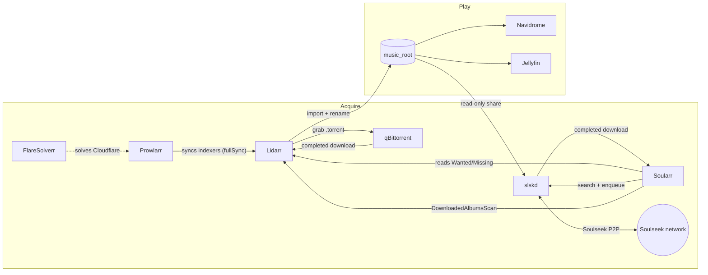

# Music pipeline

How music gets from "I want this album" to "it plays on my phone" on Theseus.

## Roles of each service

| Service | Role | Talks to |
| --- | --- | --- |
| **Lidarr** | Source of truth for *what* should be in the library: monitored artists, the Wanted/Missing list (~4k albums), quality profiles (`Lossless`, `Standard`, `Any`), renaming and import. | Prowlarr (indexers), qBittorrent (download client), Soularr (via its API). |
| **Prowlarr** | Indexer manager. Holds the torrent trackers (RuTracker, Toloka, PandaCD, …) and pushes them into Lidarr (`fullSync`), so indexers are configured only once. | Lidarr, FlareSolverr. |
| **FlareSolverr** | Headless browser proxy Prowlarr uses for trackers behind Cloudflare challenges. | Prowlarr. |
| **qBittorrent** | Torrent download client. Lidarr sends grabs to it and watches for completion. | Lidarr. |
| **slskd** | Soulseek client with a web UI and REST API. Shares the music library (read-only) and downloads into `media/soulseek/downloads`. | Soulseek network, Soularr. |
| **Soularr** | Glue script (runs every `slskd_soularr_interval` seconds, started only once slskd is healthy). Soulseek is not a Lidarr indexer or download client in stable Lidarr, so Soularr plays both roles from outside. | Lidarr API, slskd API. |
| **Navidrome** | Subsonic-compatible streaming server over `music_root` (read-only). Used by phone/desktop clients. | — |
| **Jellyfin** | Also indexes `music_root` for its own clients. | — |

## Lidarr → Soularr → slskd in detail

Soularr is a sidecar in the `slskd` role (`roles/applications/slskd`). Each run:

1. **Read Wanted.** It calls Lidarr `wanted/missing` (`search_source = missing`). With
   `search_type = incrementing_page` it takes the next page of
   `slskd_soularr_albums_per_run` albums and stores the page cursor in
   `soularr/.current_page.txt`. The backlog is walked a few albums per run
   instead of all 4k at once.
2. **Search.** For each album it asks slskd to search `"<artist> <album>"`, waits
   `search_timeout`, and scores the results. The folder must contain the right
   track count for one of the album's releases (`accepted_formats`,
   `accepted_countries`), filenames must match track titles
   (`minimum_filename_match_ratio`), and files must be one of
   `slskd_soularr_allowed_filetypes` (tried in order: FLAC hi-res → FLAC → MP3 320).
   Peers with long queues are skipped (`maximum_peer_queue`).
3. **Enqueue.** It enqueues the best folder in slskd. slskd downloads into
   `/incomplete`, then moves the files to `/downloads/<folder>`.
4. **Wait and import.** On later runs it checks the transfers. When a folder is complete, it
   moves the folder to `Artist - Album` and calls Lidarr's
   `DownloadedAlbumsScan` command with the path as **Lidarr** sees it
   (`slskd_lidarr_downloads_directory`). From then on this is a normal Lidarr import:
   matching, quality-profile checks, renaming into `music_root`.
5. **Failures.** No results means the album stays Wanted and gets another chance on a later pass
   (`remove_wanted_on_failure` is off). Stalled transfers are cancelled
   after `stalled_timeout`. A folder that Lidarr refuses to import is
   denylisted (`failed_import_denylist`) so the same bad folder isn't retried.
   None of this touches the torrent path. Lidarr keeps searching indexers on its own schedule,
   and whichever source lands first wins.

### Path mapping (why downloads live under `media/`)

Lidarr has a single mount: `qbittorrent_download_directory` (`/mnt/data/data`) → `/downloads`.
A second mount would get a different device id and break hardlinks and moves. slskd's download dir
therefore sits inside that tree:

| Host | slskd | Soularr | Lidarr |
| --- | --- | --- | --- |
| `/mnt/data/data/media/soulseek/downloads` | `/downloads` | `/downloads` | `/downloads/media/soulseek/downloads` |
| `/mnt/data/data/media/soulseek/incomplete` | `/incomplete` | — | — |
| `/mnt/data/data/media/music` (`music_root`) | `/music` (ro, shared) | — | `/downloads/media/music` (root folder) |

`slskd_lidarr_downloads_directory` derives the Lidarr-side path automatically.

### Quality

Soularr only filters by file type. The import decision stays with Lidarr: an MP3
downloaded for an artist on the `Lossless` profile is rejected at import and
denylisted. To avoid wasted downloads, keep `slskd_soularr_allowed_filetypes`
in line with the profiles in use.

## Configuration

- Role vars: `roles/applications/slskd/defaults/main.yml`.
- Enable: `slskd_enabled`, `slskd_soularr_enabled` in `inventories/local/group_vars/nas/main.yml`.
  Turning Soularr off leaves slskd running for manual use (`remove_orphans` drops the container).
- Secrets (`secrets.yaml`): `slskd_soulseek_username`, `slskd_soulseek_password` (the account
  is registered on first login), `slskd_web_password`, `slskd_api_key`. Soularr also uses the existing
  `lidarr_api_key`.
- Throughput: `slskd_soularr_albums_per_run` × runs per day
  (`86400 / slskd_soularr_interval`). The defaults (5 every 5 min, at most about 1,400 per day) are sized for
  the first rollout. Raise them once imports are confirmed working.
- Network: port `50300` is published on the host but **not forwarded on the router**, so peers
  can't open connections to us. Downloads from firewalled peers can fail. That's acceptable for now.
- UI: `http://slskd.theseus` (LAN only, `web_local`).

## Rollout checklist

1. `task theseus -- slskd`
2. slskd UI: logged in to Soulseek, share scan finished.
3. `docker logs -f soularr`: first run searches 5 albums and enqueues matches.
4. Lidarr → Activity/History shows the imports. Files appear under `music_root`, and Navidrome picks them up on its next scan.
5. Tune `slskd_soularr_albums_per_run` / `slskd_soularr_interval`.
